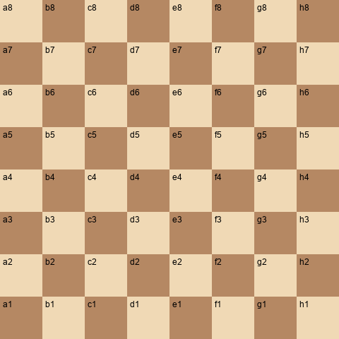

# Chessboard Square Classifier

Pipeline to convert labeled chess video frames into per-square training data and evaluate predictions.

## Repo layout
- `Data/` raw per-game folders (`gameX_per_frame/` with `tagged_images/` and `gameX.csv`).
- `dataset_tools/` dataset factory, FEN utilities, debug visualizations, evaluation.
- `dataset_out/` generated artifacts (manifest, classes.json, debug images) — typically not committed.

## Setup
1. Create a virtual environment (example): `python -m venv .venv`
2. Activate (PowerShell): `.\.venv\Scripts\Activate.ps1`
3. Install deps: `pip install -r requirements.txt`

## Dataset build (Phase 1)
- Default manifest + class map (80/20 row-wise, seed=42): `python -m dataset_tools.make_dataset --data_root Data --out_root dataset_out`
- Adjust splits/seed: `--train_ratio 0.75 --val_ratio 0.05 --seed 1234`
- Optional board detect + warp before the 8x8 grid: add `--detect_board --warp_size 800` (requires `opencv-python`).
- Optional: generate debug grids to verify orientation.

Board detect helper (standalone): `python -m dataset_tools.board_detect_and_warp --image <frame> --out_warp <out.png> --out_debug <debug.png>`.

## Additional datasets (optional)
- Lichess PGN/position dumps: https://database.lichess.org/
- Kaggle Chess Piece Images dataset: https://www.kaggle.com/datasets/koryakinp/chess-pieces-images
- Kaggle Chess Positions (FEN) dataset: https://www.kaggle.com/datasets/ronakbadhe/chess-position-dataset

## Evaluation (later)
- Compare predictions vs manifest: `python dataset_tools/eval.py --manifest dataset_out/dataset_manifest.csv --preds path/to/preds.csv`

## Git workflow
- Create feature branches (`feature/dataset-pipeline`, `feature/model-training`).
- Keep `master` runnable; use small, descriptive commits.
- Do not commit large data (`Data/`, `dataset_out/`, `checkpoints/`, `outputs/`).

